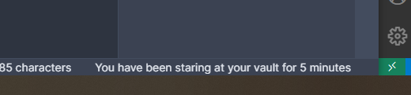

# Obsidian Plugin *YouHaveBeenStaring*

This is a plugin for Obsidian (https://obsidian.md). Sweet, short and a subtle reminder that you might want to take a break from staring at your screen 🧐.

It tells you in natural language in the status bar for how long your vault is open (since how long ago the plugin was loaded).

## How to use

Simply download and install this plugin in your *.obsidian/plugins* folder.

Then restart your Obsidian instance, navigate to "Settings -> Third-party plugins" and enable "YouHaveBeenStaring".

You will see the time since when you've been staring at your vault in the lower right status bar.

